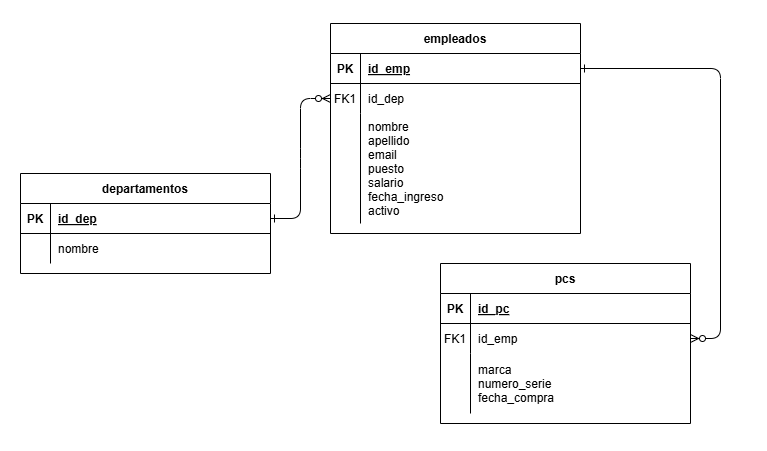
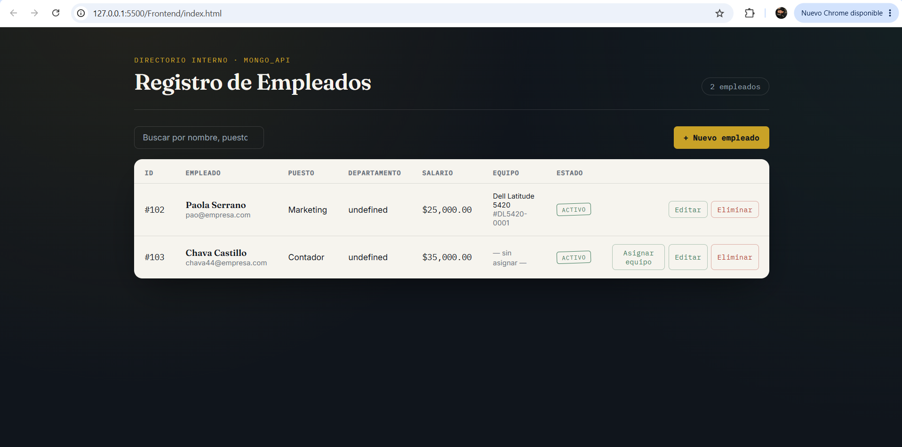
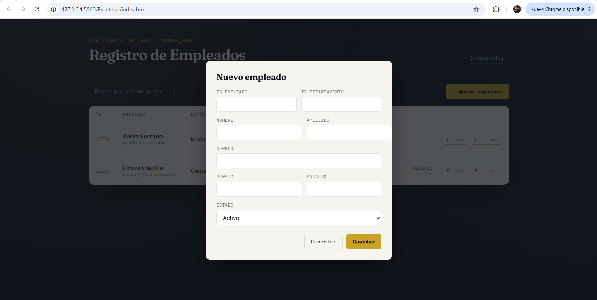
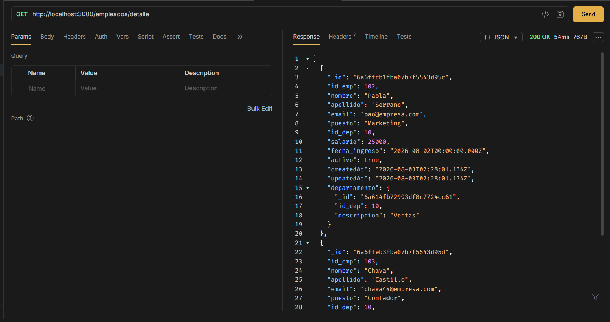
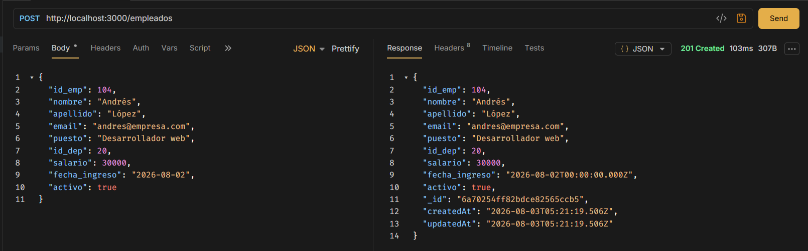

# 🚀 Proyecto Final - Sistema de Gestión API REST (NestJS & MongoDB)

**Universidad Politécnica de Aguascalientes**  
**Materia:** Bases de Datos Avanzadas  
**Profesor:** Juan Carlos Herrera Hernández

## 👥 Integrantes del Equipo
* Mauricio Andrés Rodríguez López UP240570
* Paola Maricruz Serrano Sánchez UP240588
* Gabriel Alejandro Padilla Andrade UP240903

---

## 📌 Descripción del Proyecto
API RESTful desarrollada con **NestJS** y **MongoDB** para gestionar el inventario de equipos de cómputo (`pcs`), la información de los `empleados` y los `departamentos` a los que pertenecen, permitiendo consultas avanzadas con agregaciones (`$lookup`).

---

## 🗄️ 1. Base de Datos (MongoDB)

### 📊 Diagrama del Modelo
El modelo contempla las colecciones de **`pcs`**, **`empleados`** y **`departamentos`**.



```text```
  [ pcs ] 0..1  <----->  1 [ empleados ] N  <----->  1 [ departamentos ]


## 💻 2. Backend (NestJS) (Librerías y comandos npm install, npm run start:dev).
### 📦 Librerías Empleadas
* `@nestjs/core` & `@nestjs/common` - Núcleo del framework NestJS.
* `@nestjs/mongoose` & `mongoose` - ODM para la conexión y modelado con MongoDB.
* `class-validator` & `class-transformer` - Validación de DTOs y datos de entrada.

### ⚙️ Comandos de Instalación y Ejecución

- **Instalar dependencias:**
   ```bash
   npm install
- ***Iniciar servidor:*
   ```bash
   npm run start:dev


## 🎨 3. Frontend 
* El código fuente del Frontend se encuentra en la carpeta `/Frontend`.

## ⚙️ Comandos para ejecutar
Primero se corre el backend, y en seguida el frontend:
```bash```
- cd Frontend
- npm install
- npx serve


### 🖼️ Capturas de Pantalla en Ejecución






#
## 🧪 4. Pruebas de API (Bruno) (las instrucciones de la carpeta /bruno-peticiones).
La colección completa de peticiones HTTP para probar los endpoints de la API (`pcs`, `empleados` y `departamentos`) se encuentra en la carpeta `/bruno-peticiones`.

### 🚀 Pasos para ejecutar las pruebas:
1. Abrir la aplicación **Bruno**.
2. Hacer clic en el botón **Open Collection**.
3. Seleccionar la carpeta `bruno-peticiones` ubicada en la raíz de este proyecto.
4. Asegurarse de que el Backend esté corriendo en `http://localhost:3000` y ejecutar las peticiones.


### 🧪 Capturas de Pruebas en Bruno (API REST)



